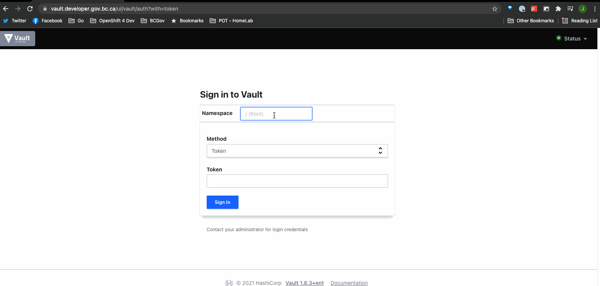

# Vault - Getting Started Guide

The Platform Services team has deployed Hashicorp's Vault application with disaster recovery in our Gold service clusters, the service is available to all BC Government Development Teams on the Silver and Gold service clusters. <https://vault.developer.gov.bc.ca>

In this guide, you will learn how to access Vault and deploy a working example using sample secrets from your Vault Mount Points. Mount Points can be thought of as "MiniVaults" or related to paths within a linux filesystem that can be locked down and secured.

## Table of Contents

- [Vault - Getting Started Guide](#vault---getting-started-guide)
  - [Table of Contents](#table-of-contents)
  - [Access](#access)
    - [User Access](#user-access)
      - [Vault UI](#vault-ui)
      - [Vault CLI](#vault-cli)
    - [Kuberenetes Service Account Access](#kuberenetes-service-account-access)
      - [Kubernetes Authentication Test](#kubernetes-authentication-test)
  - [Support](#support)
  - [References](#references)

## Access

Access is broken up into User Access and Kubernetes (k8s) Service Account, or KSA for short, Access. User Access gives authorized users the ability to write secrets, while KSA Access only provides read access.

### User Access

User Access is controlled through a combination of RedHat Single-Sign On (Keycloak) and automation integrated with the Platform Services Registry. Access to Vault is granted to up to two technical contacts set for a team's project set in the [Platform Services Regisstry](https://registry.developer.gov.bc.ca/). These technical contacts will be given write access to the Mount Points set up by the registry.

#### Vault UI

1. Head over to <https://vault.developer.gov.bc.ca/>

2. Enter `platform-services` for the **Namespace**

3. Select `OIDC` for the **Method**

4. Enter your `license_plate` for the **Role** (example uses `vault` as the `license_plate`)

5. Click **Sign In** and login with github through SSO



#### Vault CLI

1. Set Environment Vairables

    > please replace `vault` with your licensePlate

    ```bash
    export LICENSE_PLATE=vault
    export VAULT_NAMESPACE=platform-services
    export VAULT_ADDR=https://vault.developer.gov.bc.ca
    ```

2. Login

    ```console
    ❯ vault login -method=oidc role=vault
    Complete the login via your OIDC provider. Launching browser to:

        https://oidc.gov.bc.ca/auth/realms/8gyaubgq/protocol/openid-connect/auth?client_id=vault-prod&nonce=n_sQaNVeu5TNuSd2yYa0C6&redirect_uri=http%3A%2F%2Flocalhost%3A8250%2Foidc%2Fcallback&response_type=code&scope=openid+profile+oidc+groups&state=st_xKJX2EEVW6kWAXbsJv7q
    ```

3. Sign in with OIDC

4. Go back to the terminal

    ```console
    Success! You are now authenticated. The token information displayed below
    is already stored in the token helper. You do NOT need to run "vault login"
    again. Future Vault requests will automatically use this token.

    Key                    Value
    ---                    -----
    token                  <token>
    token_accessor         <string>
    token_duration         768h
    token_renewable        true
    token_policies         ["default" "vault"] # 'vault' == $LICENSE_PLATE
    identity_policies      []
    policies               ["default" "vault"] # 'vault' == $LICENSE_PLATE
    token_meta_email       justin@**********
    token_meta_role        vault # 'vault' == $LICENSE_PLATE
    token_meta_username    j-pye@github
    ```

5. Test it out!

Each Vault Mount Point (`$LICENSE_PLATE-nonprod`, `$LICENSE_PLATE-prod`) have been provisioned with a sample `helloworld` secret. Confirm those can be read with the following commands.

- nonprod

    ```console
    ❯ vault kv get $LICENSE_PLATE-nonprod/helloworld
    ====== Metadata ======
    Key              Value
    ---              -----
    created_time     2021-11-03T17:34:48.876436495Z
    deletion_time    n/a
    destroyed        false
    version          3

    ==== Data ====
    Key      Value
    ---      -----
    hello    world
    ```

- prod

    ```console
    ❯ vault kv get $LICENSE_PLATE-prod/helloworld
    ====== Metadata ======
    Key              Value
    ---              -----
    created_time     2021-10-26T14:35:30.568419117Z
    deletion_time    n/a
    destroyed        false
    version          1

    ==== Data ====
    Key      Value
    ---      -----
    hello    world
    ```

### Kuberenetes Service Account Access

Kubernetes Service Account Access is configured using k8s authentication. Vault is configured with a unique k8s auth path for each cluster that has Vault enabled.

The Vault KSA takes the form of `licensePlate-vault` in all project set namespaces. This service account should be used for the Resource that will control your pods. (Deployments, StatefulSets, etc). Additional Roles can be Bound to this KSA through a RoleBinding with the desired Role if application requires it.

**Note:** Details on authenticating with the k8s service account outside of the cluster for testing purposes are coming soon!

#### Kubernetes Authentication Test

Check out the [Getting Started Demo/Test](https://github.com/bcgov/how-to-workshops/tree/master/vault/getting-started-demo) to confirm your Project Set is provisioned with support for Vault.

> [Direct Link to Getting Started Demo/Test PR](https://github.com/bcgov/how-to-workshops/tree/vault/getting-started/vault/getting-started-demo)

## Support

Support is provided via the [#devops-vault](https://chat.developer.gov.bc.ca/channel/devops-vault) channel in RocketChat!

## References

- [Vault KV2 Usage - Official](https://www.vaultproject.io/docs/secrets/kv/kv-v2#usage)
- [Vault Annotations - Official](https://www.vaultproject.io/docs/platform/k8s/injector/annotations)